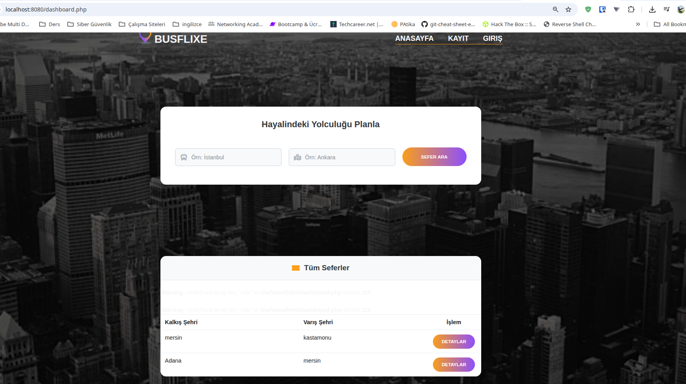
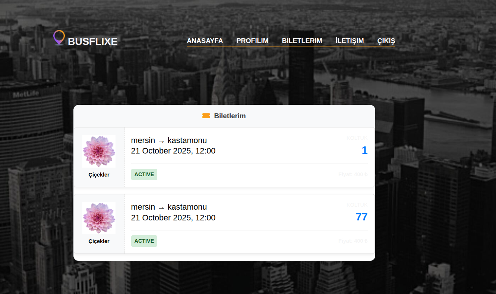
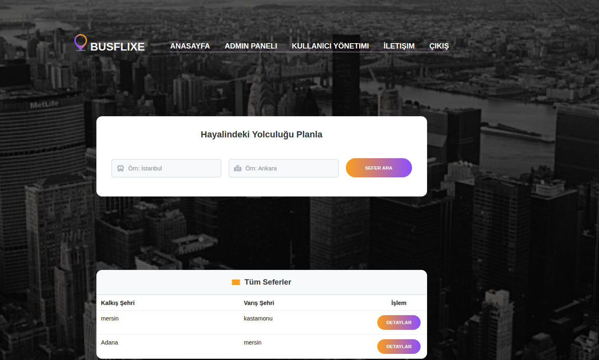
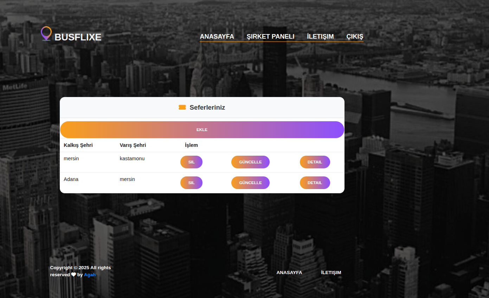
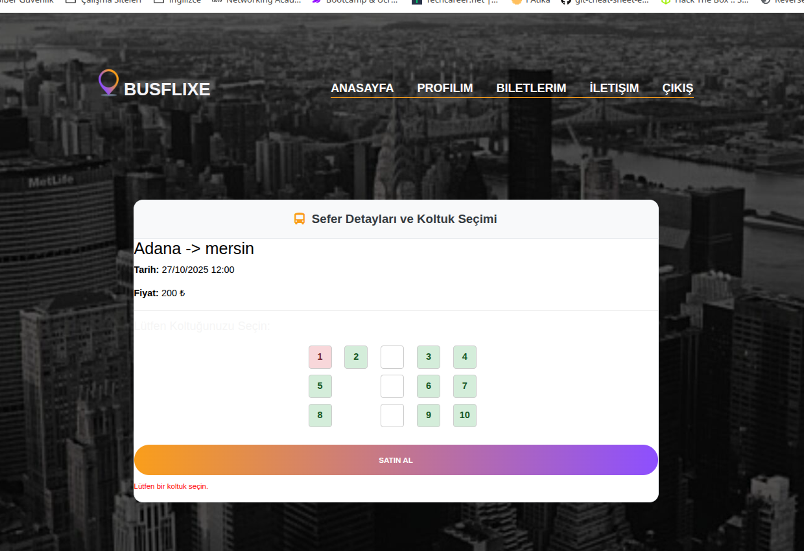
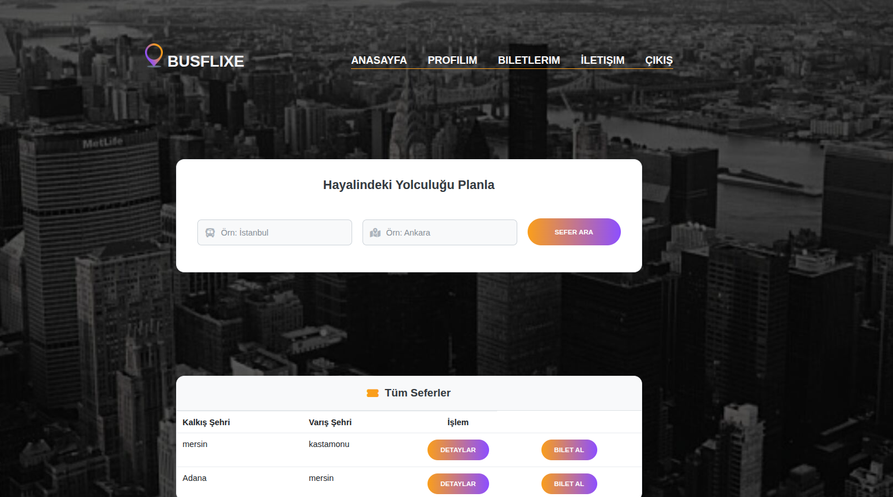

# 🚌 PHP & SQLite Otobüs Bileti Rezervasyon Sistemi

Bu proje, **PHP** ve **SQLite** kullanılarak geliştirilmiş, web tabanlı bir **otobüs bileti rezervasyon sistemidir**.  
Kullanıcılar sefer arayabilir, koltuk seçebilir, bilet satın alabilir ve rezervasyonlarını yönetebilir.  
Ayrıca farklı yetki seviyelerine sahip **admin** ve **firma yöneticisi (company admin)** panelleri sunar.

---

## 🚀 Özellikler

### 🎫 1. Kullanıcı Paneli (`/user`)

- **Biletlerim:** Aktif ve geçmiş biletleri görüntüleme (`my_ticket.php`)
- **Bilet İptali:** Kalkışa 1 saat kalana kadar bilet iptali (`cancel_ticket.php`)
- **Profil ve Ana Sayfa:** Kişisel bilgiler ve kullanıcı ana ekranı (`user_home.php`)

---

### 🧑‍💼 2. Admin Paneli (`/admin`)

- **Firma Ekleme:** Yeni otobüs firması ekleme (`add_company.php`)
- **Firma Güncelleme:** Firma bilgilerini düzenleme (`update_company.php`)
- **Firma Detayları:** Firma bilgileri ve atanmış yöneticileri görüntüleme (`company_detail.php`)
- **Firma Yöneticisi Atama:** Kullanıcıyı firma yöneticisi olarak atama (`add_company_admin.php`)
- **Kullanıcı Yönetimi:** Kullanıcıları listeleme ve yönetme (`manage_users.php`)
- **Admin Ana Paneli:** Genel sistem yönetimi ve özet ekranı (`admin_dashboard.php`)

---

### 🏢 3. Firma Yöneticisi Paneli (`/firma`)

- **Sefer Ekleme:** Yeni sefer ekleme (`add_trip.php`)
- **Sefer Güncelleme:** Mevcut seferleri düzenleme (`update_trip.php`)
- **Firma Detayları:** Firma ile ilgili detayları görüntüleme (`firma_detail.php`)
- **Firma Yönetim Paneli:** Firma için özel yönetim ekranı (`moderator_panel.php`)

---

### 🌍 4. Genel Kullanıcı İşlemleri

- **Kayıt Ol & Giriş:** Kullanıcı kaydı (`register.php`) ve giriş (`login.php`)
- **Sefer Arama:** Ana sayfada kalkış-varış şehirlerine göre sefer arama (`dashboard.php`)
- **Sefer Detayları:** Sefer detaylarını görüntüleme (`book_detail.php`)
- **Bilet Satın Alma:** Koltuk seçimi ve bilet satın alma işlemleri (`bilet_buy.php`, `bilet_buy2.php`) only user logged-in users

---

### ⚙️ 5. Ortak Bileşenler (`/includes`)

- `db.inc.php` — Veritabanı bağlantısı
- `secureSession.inc.php` — Güvenli oturum yönetimi
- `head.inc.php` — Sayfa başlığı ve meta bilgiler
- `navbar.inc.php` — Navigasyon menüsü
- `footer.inc.php` — Footer bileşeni

---

## 💻 Kullanılan Teknolojiler

| Katman                | Teknoloji               |
| :-------------------- | :---------------------- |
| **Backend**           | PHP 8+                  |
| **Veritabanı**        | SQLite 3                |
| **Frontend**          | HTML5, CSS3, JavaScript |
| **Oturum Yönetimi**   | Güvenli PHP oturumları  |
| **Veritabanı Sınıfı** | SQLite3 Class           |

---

## 🐳 Kurulum (Docker ile)

### Gereksinimler

- [Docker](https://www.docker.com/)
- [Docker Compose](https://docs.docker.com/compose/)

### Adımlar

1. Depoyu klonlayın:
   ```bash
   git clone https://github.com/Aghefendi/bus-travel-booking.git
    cd bus-travel-booking
   ```
2. Docker konteynerlerini başlatın:
   ```bash
   docker-compose up -d
   ```
3. Tarayıcınızda `http://localhost:8080` adresine gidin
4. Veritabanı dosyasının yazılabilir olduğundan emin olun:
   `bash
chmod 777 database/database.sqlite
`
   5.docker-compose down

## 📂 Project Structure

.
├── admin/
│ ├── add_company.php
│ ├── update_company.php
│ ├── company_detail.php
│ ├── add_company_admin.php
│ ├── manage_users.php
│ └── admin_dashboard.php
│
├── firma/
│ ├── add_trip.php
│ ├── update_trip.php
│ ├── firma_detail.php
│ └── moderator_panel.php
│
├── user/
│ ├── my_ticket.php
│ ├── cancel_ticket.php
│ └── user_home.php
│
├── includes/
│ ├── db.inc.php
│ ├── secureSession.inc.php
│ ├── head.inc.php
│ ├── navbar.inc.php
│ └── footer.inc.php
│
├── database/
│ └── sirket.db
│
├── docker-compose.yml
├── Dockerfile
├── index.php
├── dashboard.php
├── book_detail.php
├── bilet_buy.php
├── bilet_buy2.php
├── register.php
├── login.php
└── README.md

---

## 📸 Ekran Görüntüleri

<table align="center">
  <tr>
    <td align="center"><br/><em>Ana Sayfa</em></td>
    <td align="center"><br/><em>Biletlerim</em></td>
  </tr>
  <tr>
    <td align="center"><br/><em>Admin Paneli</em></td>
    <td align="center"><br/><em>Firma Yöneticisi Paneli</em></td>
  </tr>
  <tr>
    <td align="center"><br/><em>Bilet Satın Alma</em></td>
    <td align="center"><br/><em>Kullanıcı Ana Sayfa</em></td>
  </tr>
</table>

---

## 👨‍💻 Yazar

**Agâh**  
Full-stack geliştirici & siber güvenlik meraklısı
